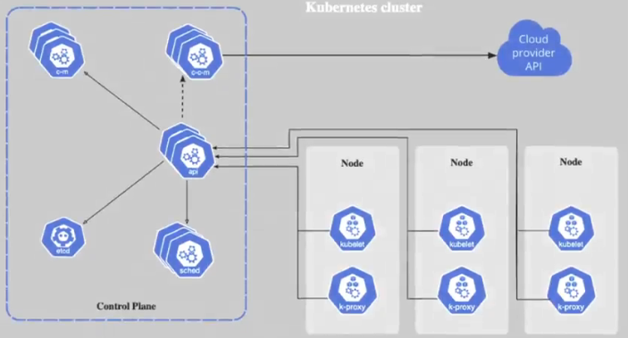
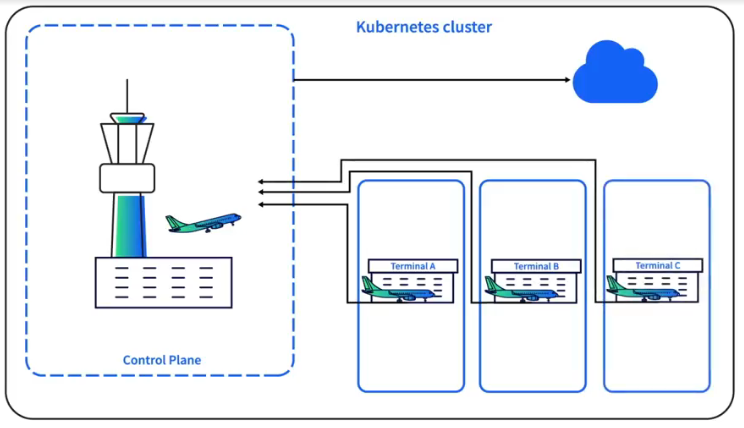
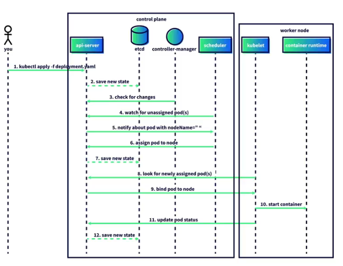
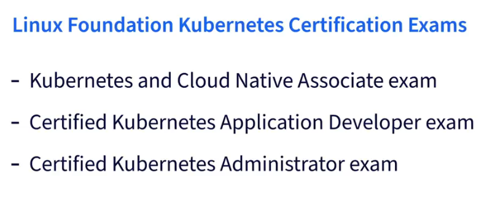

# learning-kubernetes-16086900
learning kubernetes course by Kim Schlesinger

Key points about Kubernetes:
- Container Orchestration: Kubernetes automates the deployment, scaling, and management of containerized applications.
- Scalability: It can handle large-scale applications, scaling up or down based on demand.
- Flexibility: Kubernetes can run on various environments, including on-premises data centers, public clouds, or hybrid setups.
- Community Support: It has a large community of contributors and is one of the biggest open-source projects, second only to the Linux kernel.

Containers:
- A technology that bundles the code for an app, & the configs required to run the code itself, in 1 unit

Container Advantages:
- Portable: Runs on any Linux, Windoes, or macOS machine
- Use less CPUs & memory, saving money
- Self-contained, can be spun up/down in sec
- Quick replications & elastically scale up/down

Image:
- A container image is a file with executable code that can be run as a container

Container Registry:
- A DB that stores container images; these images can be available to the public/private for those people/service accounts with permissions
    - Docker Hub
    - Quay
    - Google Container Registry

Cloud-native Tech
- Empower org to buils & run scalable apps in moderns, dynamic envs such as public, private, & hybrid clouds
- Containers, service meshes, microservices, immutable infra, & declarative APIs exemplify this approach
- Open-source projects designed to let technologists use cloud computing services to automatically deploy & scale apps

YAML -> For data serialization -> makes it portable

BusyBox
- Once you deploy something in your Kubernetes cluster, you want to verify that the application is working as expected. 
- But how can you check? One way is to use a tool called BusyBox. 
- BusyBox is known as the Swiss Army Knife of embedded Linux, 
- and it's a binary that contains many well-known Unix tools like Awk, Date, Who am I and Wget? 
- It's a good tool for debugging and troubleshooting issues in a Linux environment and Kubernetes runs on Linux.

Commands:
minikube start
alias k="kubectl"
k get namespace
k apply -f namespace.yaml
k delete -f namespace.yaml
k apply -f deployment.yaml
k get deployments -n development
k get pods                                        # run in default namespace
k get pods -n development
k delete pod {pod name} -n development
k describe pod {pod name} -n development          # Check the health of a pod by looking at event log

k apply -f busybox.yaml   

k exec -it {busybox pod name} -- /bin/sh 
                                    executable shell

wget
wget {container IP}
wget {container IP}:{container port}
cat index.html
exit

k logs {pod name} -n development

minikube tunnel
k apply -f service.yaml
k get services -n development

check in browser:  http://127.0.0.1/

ps aux | grep tunnel
sudo pkill -f "minikube tunnel"
sudo -E minikube tunnel

- How much memory & cpu should be minimum present for the pod to be scheudled
- How much max memory & cpu the pod can consume

resources:
    requests:
        memory: "64Mi"
        cpu: "250m"
    limits:
        memory: "128Mi"
        cpu: "500m"

- For cleanup:

k delete -f busybox.yaml
k delete -f deployment.yaml
k delete -f quote.yaml
k delete -f services.yaml
k delete -f namespace.yaml    

- namespace will delete everything so delete at last

# Kubernetes Architecture

- Kubernetes Cluster: A cluster consists of a control plane and at least one worker node.
- Control Plane Components: The control plane includes several components such as the Kube API Server, etcd, kube scheduler, kube-controller-manager, and cloud controller manager.
- Kube API Server: Exposes the Kubernetes API and handles most requests. It's essential for the cluster's existence.
- etcd: A key-value store that saves all data about the state of the cluster.
- kube scheduler: Assigns newly created pods to worker nodes.
- Kube-controller-manager: Ensures the cluster is running properly by checking the status of nodes and other components.
- Cloud Controller Manager: Connects the cluster with a cloud provider's API for using cloud resources.

These components work together to manage the cluster and ensure its resiliency and automation.
Airport

# Kubernetes worker nodes:

- Worker Nodes: These are like busy terminals in an airport where pods are scheduled and run.
- Kubelet: An agent on every worker node that ensures containers in a pod are running and healthy.
- Container Runtime: Starts containers using the container runtime interface (CRI) once the Kubelet assigns a new pod.
- Kube-proxy: Ensures communication between pods and services on nodes and in the control plane.

These components work together to manage and run the pods efficiently in a Kubernetes cluster.
ATC

# Worflow: Time Sequence Diagram

These steps illustrate the sequence of actions that occur to create a pod in a Kubernetes cluster.

- kubectl Command: You run the command kubectl apply -f deployment.yaml from your computer.
- Kube API Server: Receives the command and saves the deployment spec in etcd.
- Kube Scheduler: Checks for new pods that need to be assigned to a node and assigns them.
- Kubelet: On the worker node, it pulls the image and creates the container using the container runtime.
- Pod Status: The kubelet sends the pod status back to the API server, which updates the state in etcd.

# Summary

Kubernetes Cluster Components  
A Comprehensive Glossary of Kubernetes Cluster Components
Location in Cluster: Control Plane

Cloud Controller Manager: Connects a Kubernetes cluster to a cloud provider's API, managing cloud-specific resources and ensuring proper integration with the underlying infrastructure
etcd: A key-value store that saves all data about the state of the cluster; only the kube-apiserver can communicate directly with etcd
kube-apiserver: The kube-apiserver is a key component of Kubernetes that exposes the Kubernetes API, handles most requests, and manages interactions with the cluster by processing and validating API requests, making it essential for the cluster's operation
kube-controller-manager: Monitors the Kubernetes cluster's state, running processes to ensure the current state matches the desired state
kube-scheduler: Identifies a newly created pod that has not been assigned a worker node and assigns it to a specific node
Location in Cluster: Worker Nodes 

Container Runtime: Pulls container images, creates and manages containers, and ensures they run properly and securely as directed by the Kubernetes control plane
kube-proxy: A network proxy that runs on each node in a Kubernetes cluster, maintaining network rules and enabling communication between pods and services within the node and the control plane, while also communicating directly with the kube-apiserver
kubelet: An agent that runs on each node in a Kubernetes cluster, ensuring containers in a pod are running and healthy while communicating with the API server in the control plane to maintain the desired state of the node

Kubernetes v1.24 removed the Dockershim. How has this change impacted Kubernetes?
Kubernetes can no longer use the Docker engine to run containers.
It can still run docket images though.

# Ways to manage k8 pods
- Kubernetes Deployment: The most common way to deploy containerized applications, allowing control over the number of replicas and enabling no-downtime upgrades.
- DaemonSet: Deploys one copy of a container on every node in the cluster, typically used for running background processes or collecting metrics. DaemonSets allow you to run one pod per node, which works well for running pods implementing background processes such as agents.
- Kubernetes Job: Creates one or more pods to run a container until it completes its task, suitable for tasks that need to be run occasionally.

# Running stateful workloads

- External Database Connection: You can connect your application to a database running outside of your Kubernetes cluster, such as a managed database service like Azure SQL, Amazon RDS, or Google Cloud SQL.
- Kubernetes Persistent Volumes: These are used for data storage within your cluster and remain even after a pod is destroyed. You can use a stateful set to ensure your application communicates with the same volume as the previous pod.
- Two Main Approaches: 2 main approaches to making a stateful application work in your cluster: setting up an independent database or using Kubernetes Persistent Volumes.

# k8 security
- Add Security Context to Pods: Ensure containers run as non-root and make the file system read-only to prevent unauthorized access and modifications.
- Scan YAML Manifests: Use tools like Snyk to scan your Kubernetes YAML manifests for security issues.
- Regularly Update Kubernetes: Keep your Kubernetes version up-to-date, especially when security patches are released.

These practices help protect your Kubernetes clusters from common security threats.

sudo apt update
sudo apt install -y nodejs npm

node -v
npm -v

snyk --version

snyk auth

snyk iac test secure-deployment.yaml

